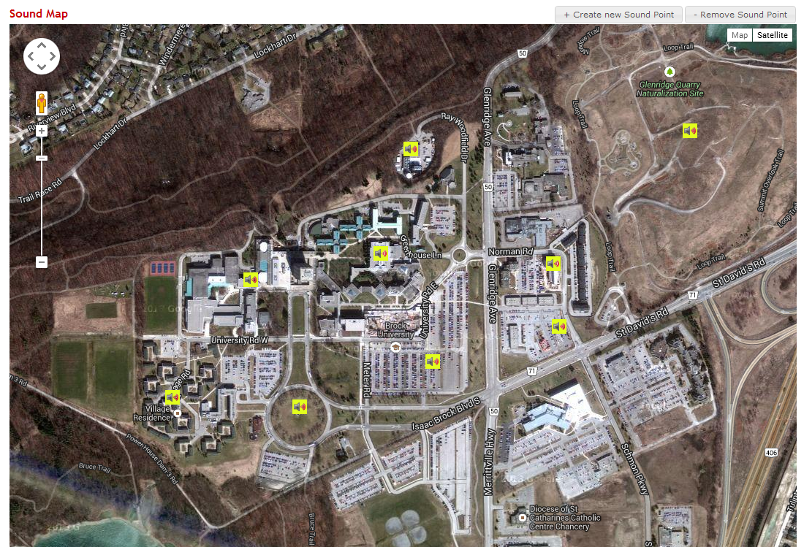

GoogleMap InfoDialogs via PHP with Map Picker
==============

Uses Google Map v3 Api to generate a Map with InfoDialogs on demand based on generated XML objects. Also allows for the addition and deletion of these object on demand via modals.

Basic map structure based on: https://developers.google.com/maps/articles/phpsqlajax_v3
Javascript location picker from: https://github.com/kingmook/locationpicker

